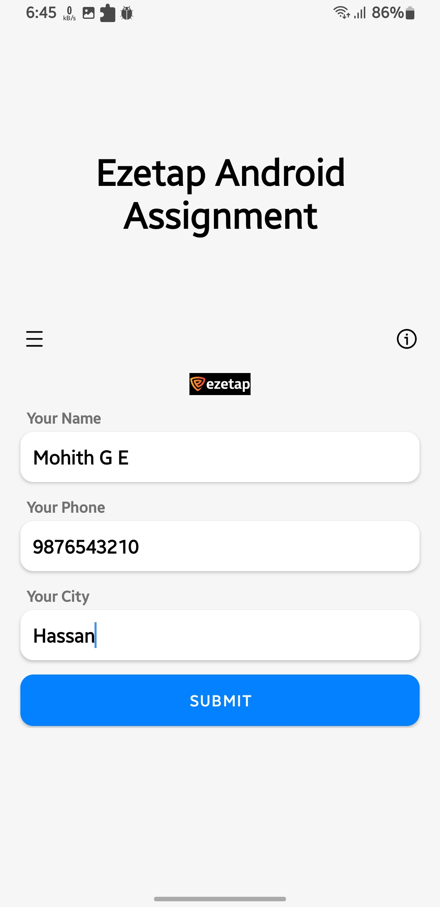
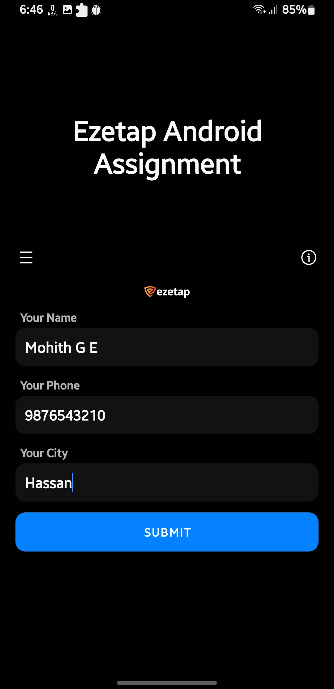
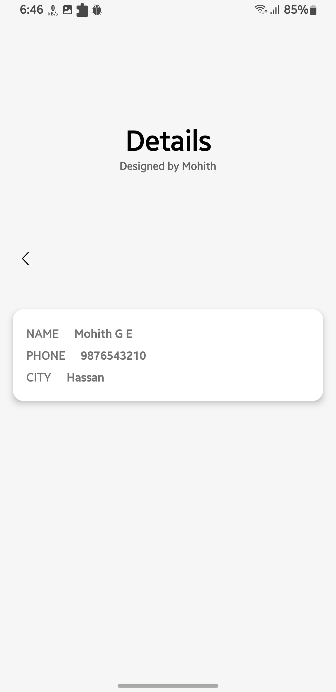
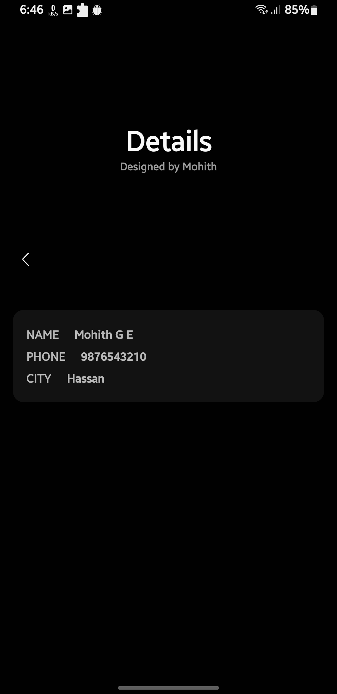
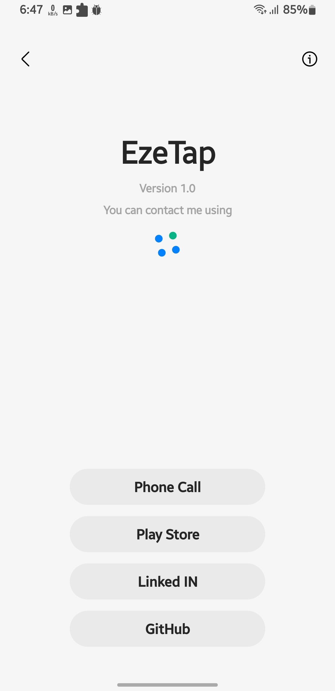
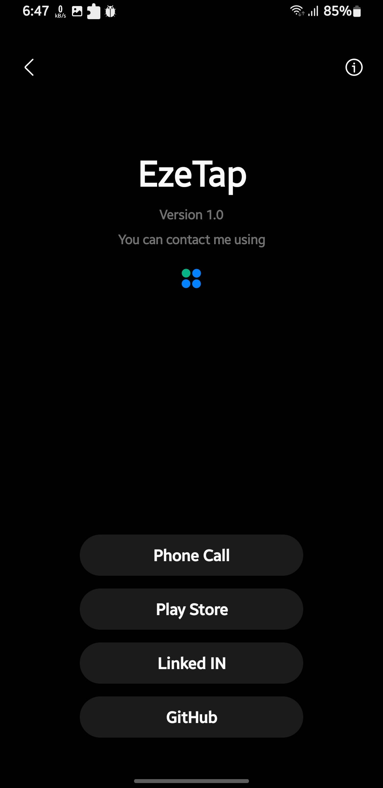

# EzeTap

#### ⚠️This app is an assignment EzeTap company and this is temp repository 

     

## About the app

1. Language : Kotlin
2. API Library : Retrofit
3. Pattern ; MVVM
4. UI : OneUI 4
5. suports both Light and Dark Theme
6. you can contact me my [Downloading](https://github.com/BlackMesa123) the app and click info menu item, there you can get my phone number, play store, linked in and github links
